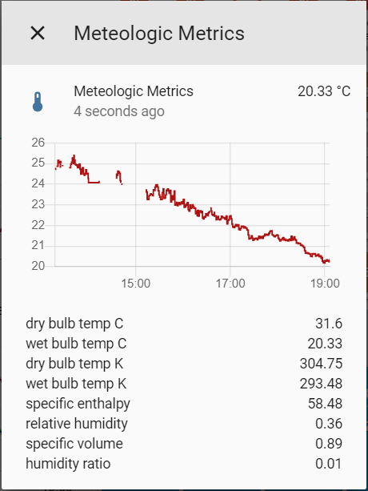

This component calculates psychrometric states of moist air using ASHRAE 2009 Fundamentals formulations. Atmospheric pressure, and humidity must be given to calculate the other propreties.



The state properties include:

* dry bulb temperature (DBT), 
* specific enthalpy (H), 
* relative humidity (RH), 
* specific volume (V), 
* humidity ratio (W), 
* and wet bulb temperature (WBT)
* wet bulb temperature (estimate from dewpoint depression - using [the 1/3 rule](https://www.theweatherprediction.com/habyhints/170/))

# Configuration

```yaml
sensors:
  - platform: meteologic_metrics
    name: "Meteologic Metrics"              # optional, use if you want to use mulitple instances
    temp: sensor.outside_temp               # celsius
    hum: sensor.outside_hum                 # celsius
    dew: sensor.bom_perth_dew_point_c       # required if you want WBT estimated with dewpoint depression
    pressure: sensor.bom_perth_pressure_mb  # millibar == hectopascal == pascal * 100
```